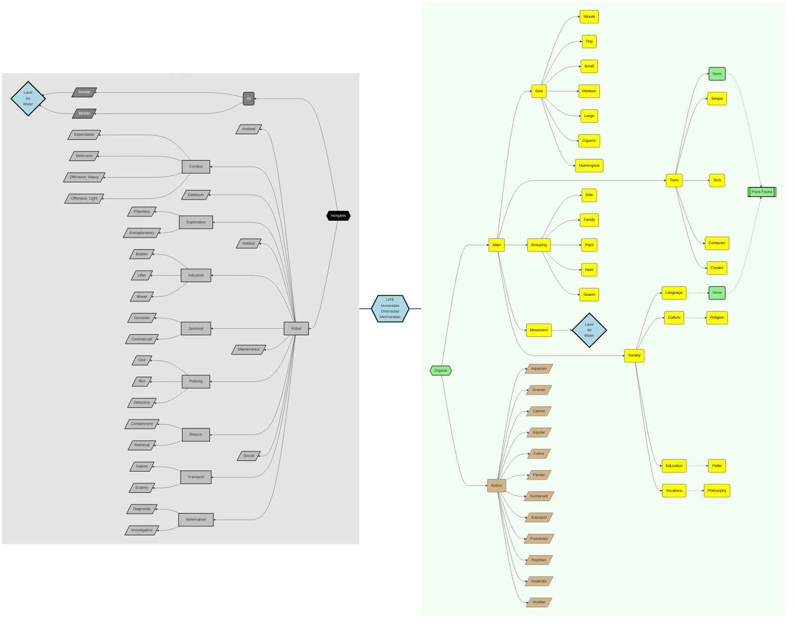

```mermaid
flowchart LR
    %% flowchart outlining the forms consciousnesses in EXP    
    INORGANIC === LIFE{{LIFE<br>Hominidae<br>Diversidae<br>Mechanidae}} === ORGANIC

    subgraph INORGANIC
        direction RL
        Inorganic{{Inorganic}} ---> AI(AI)
        Inorganic --> Robot[Robot]
            AI ----> AS[/Sessile/]
            AI ----> AM[/Mobile/]
                AS --> LAW{Land <br> Air <br> Water}
                AM --> LAW

        Robot --> A[/Android/]
        Robot ---> C[Combot]
            C ---> CE[/Expendable/]
            C ---> CD[/Defensive/]
            C ---> COH[/Offensive, Heavy/]
            C ---> COL[/Offensive, Light/]

        Robot ---> D[/Datalyzer/]
        Robot ---> E[Exploration]
            E --> EP[/Planetary/]
            E --> EX[/Extraplanetary/]
        Robot --> H[/Hobbot/]
        Robot ---> I[Industrial]
            I --> IB[/Builder/]
            I --> IL[/Lifter/]
            I --> IM[/Mover/]
        Robot ---> J[Janitorial]
            J --> JD[/Domestic/]
            J --> JC[/Commercial/]
        Robot --> M[/Maintenance/]
        Robot ---> P[Policing]
            P --> PC[/Civil/]
            P --> PR[/Riot/]
            P --> PD[/Detective/]
        Robot ---> R[Rescue]
            R --> RC[/Containment/]
            R --> RR[/Retrieval/]
        Robot --> S[/Social/]
        Robot ---> T[Transport]
            T --> TI[/Inatmo/]
            T --> TX[/Exatmo/]
        Robot ---> V[Veterinarian]
            V --> VD[/Diagnostic/]
            V --> VI[/Investigative/]
    end

    subgraph ORGANIC
        direction LR
        Organic{{Organic}} ---> Alien(Alien)
            Alien --> Size(Size)
                Size --> Minute(Minute)
                Size --> Tiny(Tiny)
                Size --> Small(Small)
                Size --> Medium(Medium)
                Size --> Large(Large)
                Size --> Gigantic(Gigantic)
                Size --> Hughmongous(Humongous)

            Alien ----> Tool(Tools)
                Tool --> None(None) -.-> Flora[[Flora Fauna]]
                Tool --> Simple(Simple)
                Tool --> Tech(Tech)
                Tool --> Computer(Computer)
                Tool --> Creator(Creator)
            Alien --> Group(Grouping)
                Group --> Solo(Solo)
                Group --> Family(Family)
                Group --> Pack(Pack)
                Group --> Herd(Herd)
                Group --> Swarm(Swarm)
            Alien --> Move(Movement) --> LAW2{Land <br> Air <br> Water}
            Alien ----> Society(Society)
                Society --> Lang(Language) -.-> Nolang(None) -.-> Flora
                Society --> Cult(Culture) -.-> Religion(Religion)
                Society --> Edu(Education) -.-> Politic(Politic) 
                Society --> Voc(Vocations) -.-> Phil(Philosophy)

        Organic ---> Anthro(Anthro)
            Anthro --> Aq[/Aquarian/]
            Anthro --> Av[/Avarian/]
            Anthro --> Ca[/Canine/]
            Anthro --> Eq[/Equine/]
            Anthro --> Fe[/Feline/]
            Anthro --> Fl[/Florian/]
            Anthro --> Hu[/Humanoid/]
            Anthro --> In[/Insectoid/]
            Anthro --> PS[/Purestrain/]
            Anthro --> Re[/Reptilian/]
            Anthro --> Ro[/Rodentia/]
            Anthro --> Ur[/Ursidae/]
    end


    %% of course styling goes at the end. of course!
    classDef default fill:white,stroke:black,stroke-width:2px;

    %% define blue backgrounds
    classDef starter fill:lightblue,stroke:black,stroke-width:4px;

    %% define organic side stuff
    classDef organo fill:lightgreen
    classDef back_organo fill:lightgreen,opacity:.1;
    classDef skinny fill:tan,stroke:#333,stroke-width:1px;
    classDef ally fill:yellow,stroke:black,stroke-width:1px,color:black;

    %% define inorganic side stuff
    classDef inorgano fill:black,color:white;
    classDef back_inorgano fill:black,opacity:.1;
    classDef robotoid fill:silver
    classDef aiaio fill:Gray, color:white

    %% apply the blue CSSes
    class LIFE,LAW,LAW2 starter

    %% apply the organic CSSes
    class Organic organo
    class ORGANIC back_organo
    class Anthro,Aq,Av,Ca,Eq,Fe,Fl,Hu,In,PS,Re,Ro,Ur skinny
    class Alien,Size,Tool,Group,Move,Society ally
    class Minute,Tiny,Small,Medium,Large,Gigantic,Hughmongous ally
    class Solo,Family,Pack,Herd,Swarm ally
    class Simple,Tech,Computer,Creator ally
    class Lang,Cult,Edu,Voc,Religion,Politic,Phil ally
    class None,Nolang,Flora organo

    %% apply the inorganic CSSes
    class Inorganic inorgano
    class INORGANIC back_inorgano
    class Robot,A,C,CE,CD,COH,COL,D,E,EP,EX,H,I,IB,IL,IM,J,JD,JC,M,P,PC,PD,PR,R,RC,RR,S,T,TI,TX,V,VI,VD robotoid
    class AI,AS,AM aiaio

```