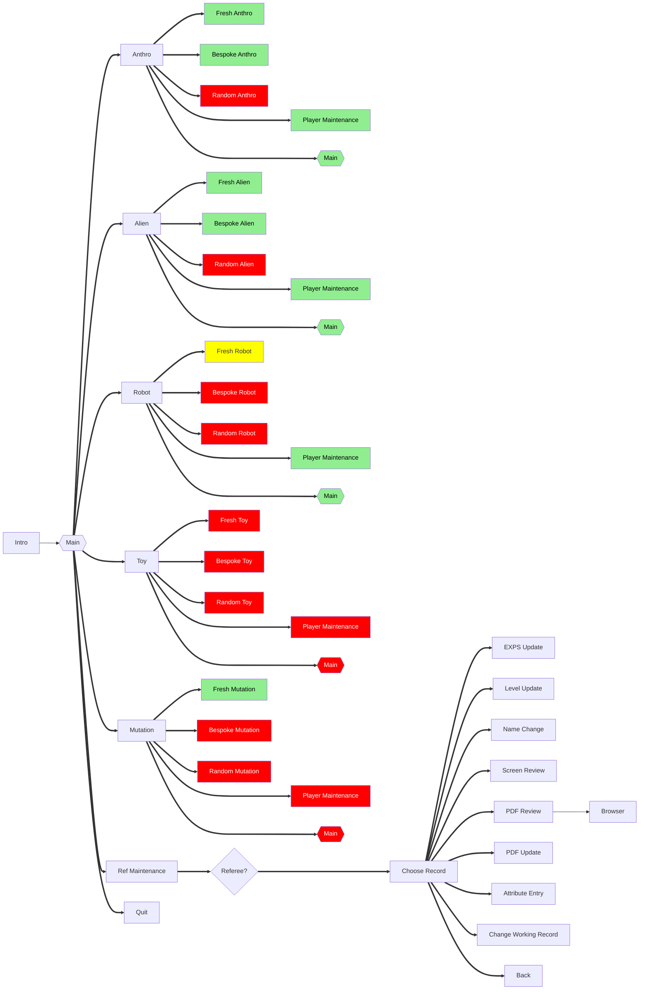

Tool Tree for EXP Python Support tools

```mermaid
flowchart LR
    intro[Intro]-->Main
    Main{{Main}}==>Anthro[Anthro]
    Main==>Alien[Alien]
    Main==>Robot[Robot]
    Main==>Toy[Toy]
    Main==>Mutation[Mutation]
    Main==>Maintenance[Ref Maintenance]
    Main==>Quit[Quit]

    Anthro==>Fresh_Anthro[Fresh Anthro]
    Anthro==>Bespoke_Anthro[Bespoke Anthro]
    Anthro==>Random_Anthro[Random Anthro]
    Anthro===>Anthro_Maintenance[Player Maintenance]
    Anthro===>Anthro_Back{{Main}}

    Alien==>Fresh_Alien[Fresh Alien]
    Alien==>Bespoke_Alien[Bespoke Alien]
    Alien==>Random_Alien[Random Alien]
    Alien===>Alien_Maintenance[Player Maintenance]
    Alien===>Alien_Back{{Main}}
    

    Robot==>Fresh_Robot[Fresh Robot]
    Robot==>Bespoke_Robot[Bespoke Robot]
    Robot==>Random_Robot[Random Robot]
    Robot===>Robot_Maintenance[Player Maintenance]
    Robot===>Robot_Back{{Main}}

    Toy==>Fresh_Toy[Fresh Toy]
    Toy==>Bespoke_Toy[Bespoke Toy]
    Toy==>Random_Toy[Random Toy]
    Toy===>Toy_Maintenance[Player Maintenance]
    Toy===>Toy_Back{{Main}}

    Mutation==>Fresh_Mutation[Fresh Mutation]
    Mutation==>Bespoke_Mutation[Bespoke Mutation]
    Mutation==>Random_Mutation[Random Mutation]
    Mutation===>Mutation_Maintenance[Player Maintenance]
    Mutation===>Mutation_Back{{Main}}

    Maintenance==>ref_check{Referee?}===>ref_chooser[Choose Record]
    ref_chooser==>exps_update[EXPS Update]
    ref_chooser==>lvl_update[Level Update]
    ref_chooser==>name_change[Name Change]
    ref_chooser==>screen_review[Screen Review]
    ref_chooser==>pdf_review[PDF Review]-->browser[Browser]
    ref_chooser==>pdf_update[PDF Update]
    ref_chooser==>attribute_entry[Attribute Entry]
    ref_chooser==>change_record[Change Working Record]
    ref_chooser==>ref_back[Back]


    classDef done fill:lightgreen,color:black;
    classDef partial fill:yellow;
    classDef pending fill:red,color:white;


    %% Anthro
    class Fresh_Anthro,Bespoke_Anthro,Anthro_Back,Anthro_Maintenance done
    class Random_Anthro pending

    %% Alien
    class Fresh_Alien,Bespoke_Alien,Alien_Back,Alien_Maintenance done
    class Random_Alien pending
    
    %% Robot
    class Robot_Back,Robot_Maintenance done
    class Fresh_Robot partial
    class Bespoke_Robot,Random_Robot pending

    %% Toy
    class Fresh_Toy,Bespoke_Toy,Random_Toy,Toy_Back,Toy_Maintenance pending

    %% Mutation
    class Fresh_Mutation done
    class Bespoke_Mutation,Random_Mutation,Mutation_Back,Mutation_Maintenance pending
```